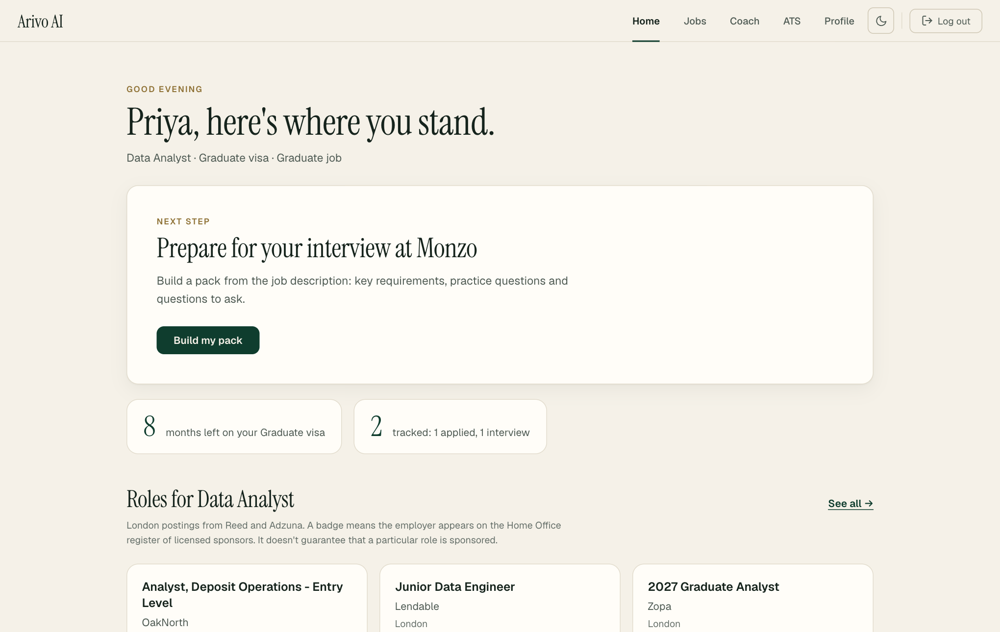
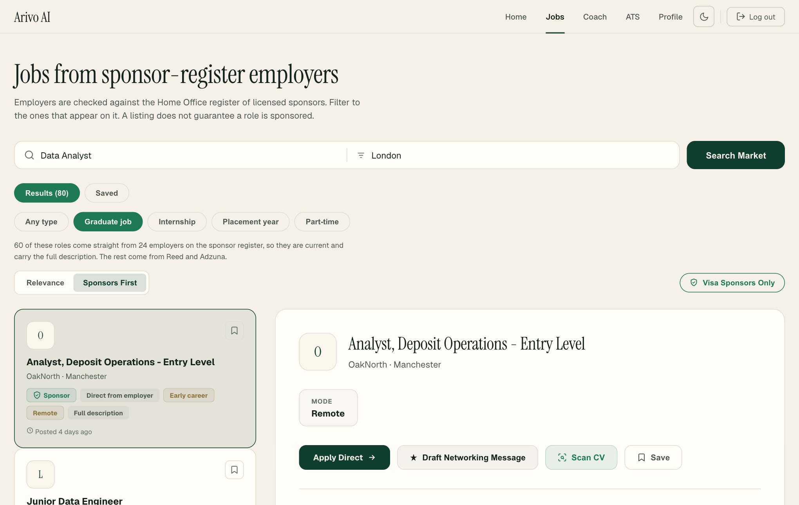
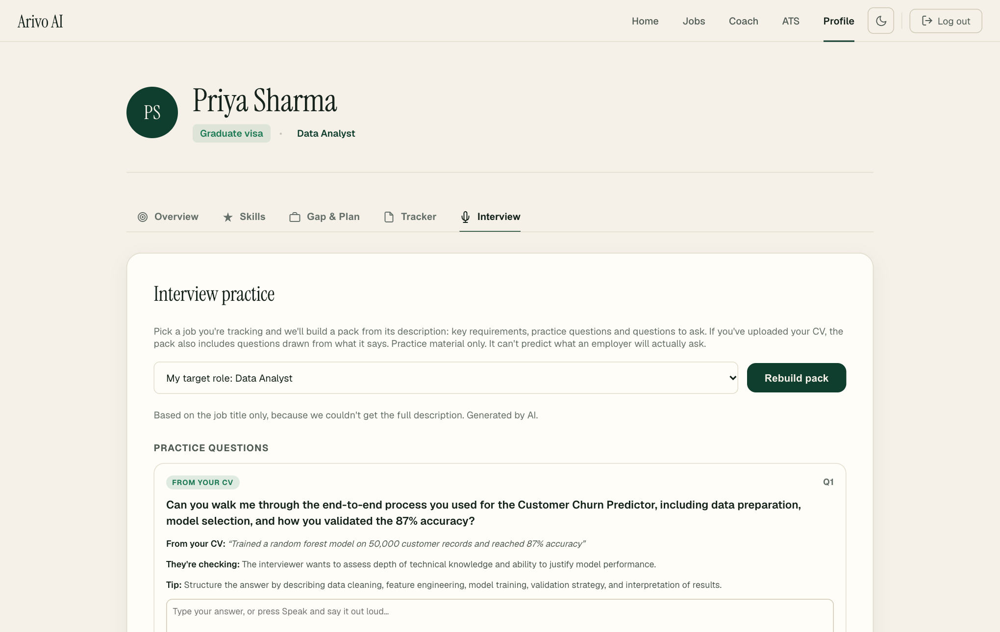
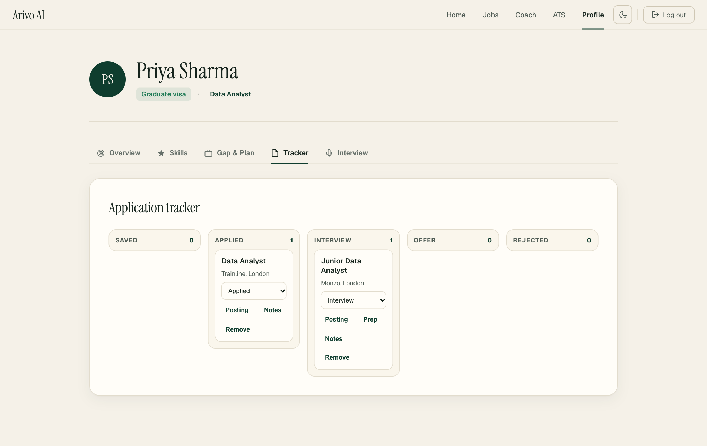
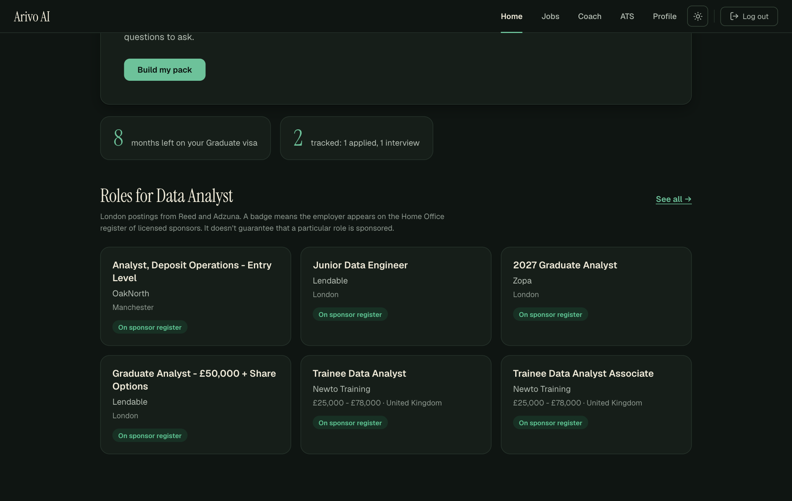
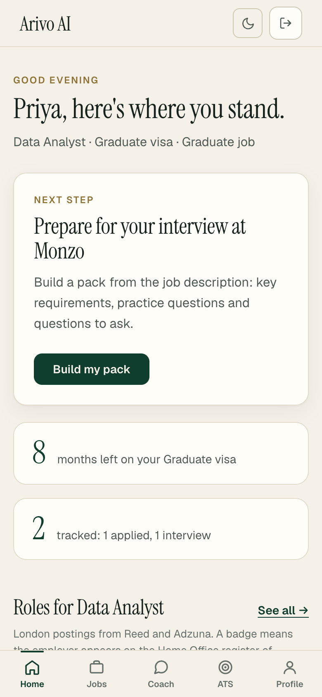
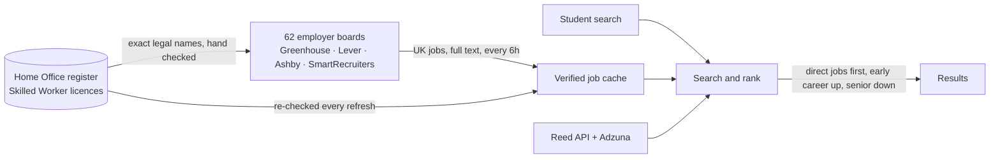
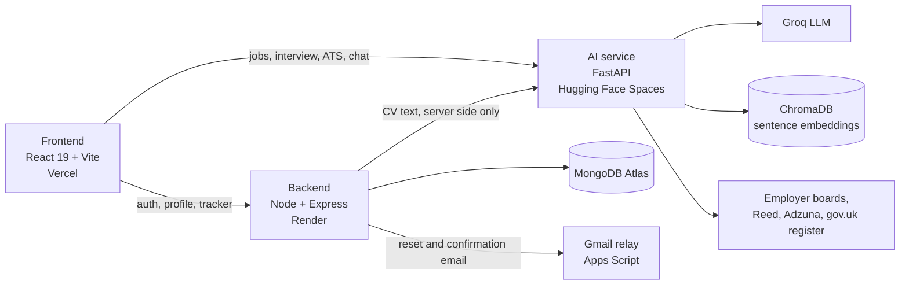

# Arivo AI

**Job search for international students in the UK, built around the one question generic job boards can't answer: can this employer legally hire me?**

[](https://github.com/Akshar246/arivo-ai/actions/workflows/test.yml)


**[Open the live app](https://arivo-ai-xi.vercel.app)** · [Backend API](https://arivo-backend-vp35.onrender.com) · [AI service](https://itsakshar-arivo-ai.hf.space/docs) · [LinkedIn](https://linkedin.com/in/akshar-chanchlani)

> The backend sleeps on its free host after 15 idle minutes, so the first request can take 30 to 50 seconds. After that it is quick.



---

## The 30 second version

- **The problem.** An international graduate on a Graduate visa has a clock running. Most job boards cannot say whether an employer holds a Skilled Worker licence, so students check the Home Office register by hand, one listing at a time.
- **What I built.** A full stack product, deployed on three services, that searches jobs from employers verified against the live Home Office register, reads each posting in full, and guides the student from CV to interview.
- **What is different.** ATS checkers, interview trackers and skill gap tools are common. Connecting the student's visa situation to the job search is not. Everything here is built on that.
- **How I work.** Every claim on screen has to be provable. If the backend cannot support a number, it does not ship. More on that below.

## What a student gets

| | |
|---|---|
| **Jobs from verified sponsors** | Up to 80 results per search. Roles taken straight from the career pages of employers whose licence is checked against the live register come first. Reed and Adzuna fill in the rest. |
| **A dashboard that says what to do next** | One next step, worked out from the student's real profile: upload a CV, run the skill comparison, check the CV against a job, save a role, or prepare for an interview that is booked. Months left on their visa and tracker counts sit beside it. |
| **Full job pages** | Full descriptions, which of the student's own skills the posting names, salary when published, and honest labels such as "Early career" and "Direct from employer". |
| **Interview practice** | A pack for each tracked job (key requirements, practice questions, questions to ask), voice answers with pace and filler word stats, and feedback that reads the answer the way a UK interviewer would. |
| **Questions drawn from the student's own CV** | Each one quotes the line of the CV it came from. See the engineering notes below for why that matters. |
| **ATS check with an International Student Lens** | Scores a CV the way applicant tracking software parses it, and flags conventions from other countries, such as a photo or date of birth, that quietly fail UK screening. |
| **Application tracker** | Saved, applied, interview, offer, rejected, with notes and a stored interview pack per role. |
| **Skill gap plan** | The student's CV skills against current London postings for their target role, with a learning plan. |
| **Light and dark themes** | One design system with shared tokens, tested at phone and desktop widths. |

<table>
<tr>
<td width="50%"><br><sub>Jobs, with the direct-from-employer and early career labels</sub></td>
<td width="50%"><br><sub>Interview questions that quote the student's CV</sub></td>
</tr>
<tr>
<td><br><sub>Application tracker</sub></td>
<td><br><sub>Dark mode</sub></td>
</tr>
</table>

<p align="center"><br><sub>The same dashboard on a phone</sub></p>

---

## How the job search works

General job boards give a thin, repetitive slice of the market, and the employer name on a listing often does not match the legal name on the Home Office register. So the search starts from the employers instead.



- **Verified, not guessed.** Each employer is listed with its exact register entry, for example Monzo as `monzo bank ltd`. On every refresh the entry is looked up in the live register. An employer that falls off the register disappears from results.
- **Numbers at the time of writing (6 October 2026).** About 122,000 organisations hold a Skilled Worker licence. 62 employers publish UK roles through the supported boards, 1,764 UK jobs in total, each with the full description. A search for "Data Analyst" returns 80 jobs, 60 of them direct from 24 employers. Before this change a search returned about 16.
- **Ranking for students.** A seniority label is read from the job title. Early career roles rank higher, Senior, Lead and Principal roles rank lower, and a phrase match counts, so "product manager" no longer ranks "product analytics manager" first.
- **A bug I found along the way.** The register lists religious, sports, creative and charity worker licences too. My original loader counted all of them, which overstated who can sponsor a graduate job by about 5,300 organisations. It now counts only the Skilled Worker route.

## Rules I built it by

These are in the code, not just the README.

1. **Only claim what can be proven.** Early drafts had plausible placeholder stats and a fake progress tracker. I removed them. A badge says "On the register" because a register lookup said so, and the page says in plain words that this does not guarantee a particular role is sponsored.
2. **Ground the AI, then check it.** Models invent things. Wherever a model's output is shown as fact about the student, the code verifies it against the source. See the CV questions below.
3. **Do not circumvent.** Adzuna's `/land/ad/` links block automated readers. I did not work around that. The app shows a clear "preview only" notice, and recovers the full text through Reed's official API when the same role is listed there.
4. **Guidance, not advice.** Immigration advice is a regulated activity in the UK. Arivo gives information with sources and tells students to confirm with their university's international advisers.

## Engineering highlights

**Grounded CV interview questions.** The model must return, with each question, an exact quote from the CV it is based on. The service then checks that the quote really appears in the CV, ignoring line breaks and bullet characters, and drops any question whose quote does not. The prompt also forbids questions about age, nationality, family, health and similar topics. The check is a small pure function with its own tests, including a made-up quote that must be rejected. The CV text itself is read on the server and never sent to the browser.

**Authentication that holds up.** Passwords are hashed with bcrypt. Password reset and email confirmation use random one-time tokens, of which only the SHA-256 hash is stored, so a leaked database cannot be used to reset anyone's account. The reset form answers identically whether or not an address exists, so it cannot be used to find out who has an account. Each sensitive route has its own rate limit. After a reset, every session issued before it is rejected. Accounts and all their data can be deleted by the student.

**Email at zero cost.** Resend only delivers to arbitrary addresses once a domain is verified, and Render's free plan blocks SMTP. So reset and confirmation emails go out through a small Google Apps Script web app that sends from a Gmail account, guarded by a shared secret. The mailer falls back to Resend when it is configured. Setup is in [`docs/mail-relay.md`](docs/mail-relay.md).

**A concurrency bug worth remembering.** Two searches at once crashed the AI service. The cause was the embedding model running on Apple's GPU backend, which is not thread safe. Pinning embeddings to the CPU fixed it, and I added request timeouts so a slow upstream cannot hang a request.

**Honest handling of messy data.** Salaries published as "£0 - £55K" are shown as "Up to £55K". Job descriptions arrive as double escaped HTML from some providers and are converted to readable paragraphs with bullets. One broken employer board never takes the rest down.

**One design system.** Every page uses the same colour tokens, including a dark theme. A scan for unreadable text found nothing on the main pages in either theme (the ATS results screen needs a real CV scan, so it was not covered), and the app is tested at phone width.

## Architecture

Three services deployed separately and talking over REST.



| Layer | Stack |
|---|---|
| Frontend | React 19, Vite, plain CSS with design tokens, no UI framework |
| Backend | Node.js, Express 5, Mongoose, JWT, bcrypt, in-memory rate limiter |
| AI service | FastAPI, LangChain, ChromaDB, Groq (`openai/gpt-oss-120b`), `all-MiniLM-L6-v2` embeddings on CPU, pdfplumber, scikit-learn |
| Data | Home Office register of licensed sponsors (live CSV, cached daily), employer job boards, Reed API, Adzuna API |
| Delivery | Docker Compose for local, Vercel, Render and Hugging Face Spaces in production, GitHub Actions for tests |

More detail is in [`docs/architecture.md`](docs/architecture.md).

## Quality

- **23 automated tests** on the AI service run in CI on every push: sponsor matching, the quote check behind the CV questions, employer board parsing for all four providers, register verification, UK location detection, ranking and salary cleanup.
- The frontend lints and builds cleanly on every change I make. 13 older lint errors remain in three files I have not got to yet.
- Honest gap: there are no automated tests yet for the Node backend or the React screens. They are covered by manual checks in a real browser, and automated coverage is on the list.

## Roadmap

**Shipped**

- [x] Sign up, onboarding (visa type, end date, what they are looking for), remember me, account deletion
- [x] Password reset and email confirmation
- [x] Application tracker, interview packs, voice practice, UK style feedback, questions from the CV
- [x] Jobs from verified sponsor employers, early career ranking, full descriptions
- [x] One design system with light and dark themes

**Next, in this order**

1. **Can this role sponsor me?** Compare a role's salary and type with the Skilled Worker rules and say "likely meets", "below the threshold" or "unclear", with the rule and its gov.uk source. Only about 6% of direct postings publish a salary, so "unclear" will be common and will be labelled as such.
2. **Sponsorship Scout.** A daily background agent that finds new roles from verified employers that fit the student, reads each posting for explicit "no sponsorship" wording and quotes it, checks the salary, and sends a short digest. Every pick shows its evidence.
3. **Visa runway and cost planner.** Months left turned into milestones, with a plain calculator for visa fees built from published figures.
4. **Application helper**, then a **live mock interviewer** that asks follow-up questions.
5. **Wider coverage.** Banks, consultancies, retailers and the NHS publish through systems the current connectors do not read. Adding them is the biggest gap in the job list.
6. **Stricter company matching** for Reed and Adzuna listings, which still use name matching that can be too loose for short names.

## Known limitations

- Direct employer jobs cover tech, fintech and AI employers today. Other sectors come from Reed and Adzuna only.
- Being on the register does not mean a particular role is sponsored. The product says so wherever it shows a badge.
- Generated questions, feedback and summaries come from a language model. They are practice material, not predictions, and are labelled as AI generated.
- Matching of Reed and Adzuna company names to the register is name based and can miss subsidiaries or occasionally match too broadly.
- The free hosting tiers are slow to wake. The Gmail relay allows roughly 100 emails a day, which is enough for now.

## Run it locally

```bash
git clone https://github.com/Akshar246/arivo-ai.git
cd arivo-ai
cp .env.example .env        # then fill in your own keys
docker compose up --build
```

Frontend on `:3000`, backend on `:5001`, AI service on `:8000`. Without Docker, run each service from its own folder (`npm run dev`, `node server.js`, `uvicorn main:app --port 8000`) and set `VITE_API_URL` and `VITE_AI_URL` for the frontend.

| Variable | Used by | Purpose |
|---|---|---|
| `MONGODB_URI`, `JWT_SECRET` | backend | Database and session signing |
| `GROQ_API_KEY` | AI service | Language model |
| `REED_API_KEY`, `ADZUNA_APP_ID`, `ADZUNA_API_KEY` | AI service | Job sources |
| `AI_SERVICE_URL` | backend | Where the backend reaches the AI service |
| `FRONTEND_URL` | backend | Used to build the links in emails |
| `MAIL_RELAY_URL`, `MAIL_RELAY_SECRET` | backend | Free email through Gmail ([setup](docs/mail-relay.md)) |
| `RESEND_API_KEY`, `MAIL_FROM` | backend | Optional alternative once a domain is verified |

With no email settings, reset and confirmation links print in the backend log during development. No secrets are committed; see `.env.example`.

Tests: `cd ai-service && pip install pytest -r requirements.docker.txt && pytest`.

## Where to look in the code

| If you want to see | Open |
|---|---|
| Employer board connectors, register check, ranking | [`ai-service/sponsor_boards.py`](ai-service/sponsor_boards.py) and its tests |
| The grounded CV question endpoint | `ai-service/main.py` (`/interview/cv-questions`) |
| Auth, reset, confirmation, rate limits | [`backend/controllers/authController.js`](backend/controllers/authController.js), [`backend/utils/mailer.js`](backend/utils/mailer.js) |
| The design system and dark theme | [`frontend/src/styles/ivory.css`](frontend/src/styles/ivory.css) |
| The dashboard's next step logic | [`frontend/src/pages/Dashboard.jsx`](frontend/src/pages/Dashboard.jsx) |

## About

Built by **Akshar Chanchlani**, an international student. MSc Artificial Intelligence at Brunel University London, BSc Computer Science at Middlesex University. I got tired of checking the sponsor register by hand, one listing at a time, so I built the tool I wanted.

[LinkedIn](https://linkedin.com/in/akshar-chanchlani) · [aksharchanchlani7006@gmail.com](mailto:aksharchanchlani7006@gmail.com)

## License

MIT, see [LICENSE](./LICENSE).
